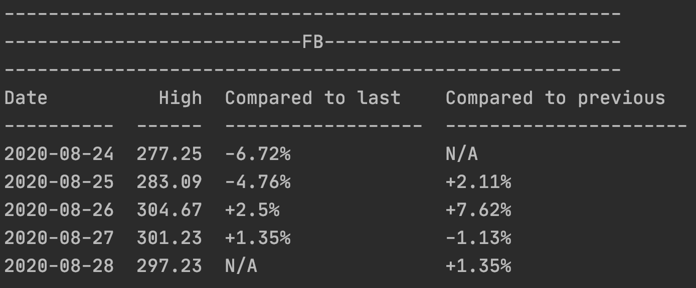

# Stocks Notifier
## Description
Shows stock prices for desired companies for a period along with price change in percentages. \
The program may run in background to show notifications when a price drops bellow desired 
percentage. (for this it takes into account only the highest price of the stock for the particular day).

## Usage
It is important to say that when comparing the stocks in order to decide whether to show notification the program takes into account 
only the highest price of the stock for the particular day. \
The program has two run modes:
1. Run foreground:
    - display stock price for particular companies for the last X (configurable) days along with percent change for the day 
    compared to the previous day and compared to the last day
    - show notification for the companies for which the change is more than Y (configurable) percent(s) in drop

    Example output:\
    
    
    Above is shown stock price for Facebook for the last 1 week. \
    "Compared to last" defines the percentages change between the current date and the last date 
    (2020-08-28 in this case) - for example the price on 2020-08-25 is with 4.76% lower than on the last day 
    of our report: 2020-08-28\
    "Compared to previous" shows the percent change between the current date and the previous one 
    (for example on 2020-08-27 the price dropped 1.13% compared to previous day: 2020-08-26)

2. Run in background:
    - when ran in background the script checks stocks for the specified companies on every H (configurable) hour(s).
    - if there is a drop more than Y (configurable) percent(s) a notification is shown. The drop should be in any of the 
    last X (configurable) days compared to the last day

## Configuration
The following are configurable inside config/config.yaml:
- the list of companies for which to show stocks and price drop notifications
- over what percentage in price drop to notify
- for how many previous days to check stocks for
- whether to run on background and if so at what time (in hours) interval to check for price drops

## Installation
After syncing the repository one must install the required packages. \
As a prerequisite python and pip (package manager for python packages) installed are required \
Then install this program packages with: \
`pip install -r requirements.txt`

## Run
Use the `start.sh` script located in the scripts folder. \
You may start it using `cd scripts && ./start.sh` \
If background running is disabled from the configuration this will execute once and stop \
Otherwise a background process will be started that will execute as often as configured in the configuration file \
The background process can be stopped using the `stop.sh` script

## Future improvements
- in future a mechanism to show N (configurable) number of times the notification per day should be added. 
This way if one have scheduled the job to run often and they already get notified 2-3 times this day it might be 
unnecessary to get notified more until the rest of the day

- adding tests